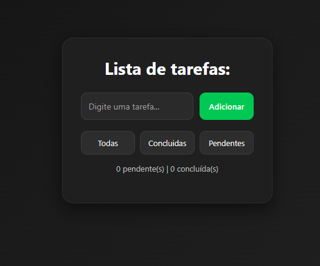

<<<<<<< HEAD
# Todo App - React

Aplicação de lista de tarefas desenvolvida em React como projeto de prática para aprimorar conceitos de front-end e gerenciamento de estado.

---

## 📸 Preview



---

## 🔗 Deploy

🔗 https://to-do-app-one-omega-33.vercel.app

---

## 🚀 Funcionalidades

- Adicionar tarefas
- Marcar tarefas como concluídas
- Remover tarefas
- Filtrar tarefas:
  - Todas
  - Concluídas
  - Pendentes
- Contador de tarefas
- Salvamento automático no Local Storage
- Layout responsivo

---

## 🛠️ Tecnologias utilizadas

- React
- JavaScript
- CSS3
- Vite

---

## 📚 Conceitos praticados

Este projeto foi desenvolvido com foco em prática de conceitos de nível júnior, incluindo:

- Componentização
- Props
- useState
- useEffect
- Manipulação de eventos
- Renderização de listas
- Manipulação de arrays com map e filter
- Persistência de dados com Local Storage
- Responsividade com CSS

---

## 📱 Responsividade

Interface adaptada para:

- Mobile
- Tablet
- Desktop

---

## ⚙️ Como executar o projeto

Clone o repositório:

```bash
git clone https://github.com/PatrickCorrea-git/To_do_app.git
```

Entre na pasta do projeto:

```bash
cd To_do_app
```

Instale as dependências:

```bash
npm install
```

Execute o projeto:

```bash
npm run dev
```

---

## 👨‍💻 Autor

- Desenvolvido por Patrick Corrêa.

- GitHub: https://github.com/PatrickCorrea-git
